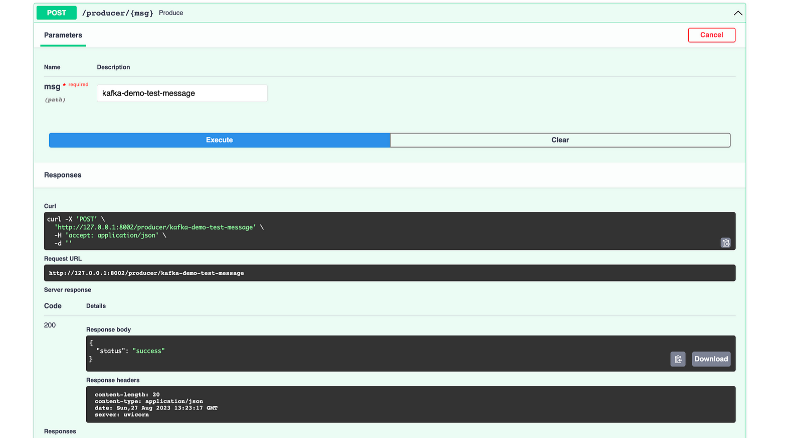
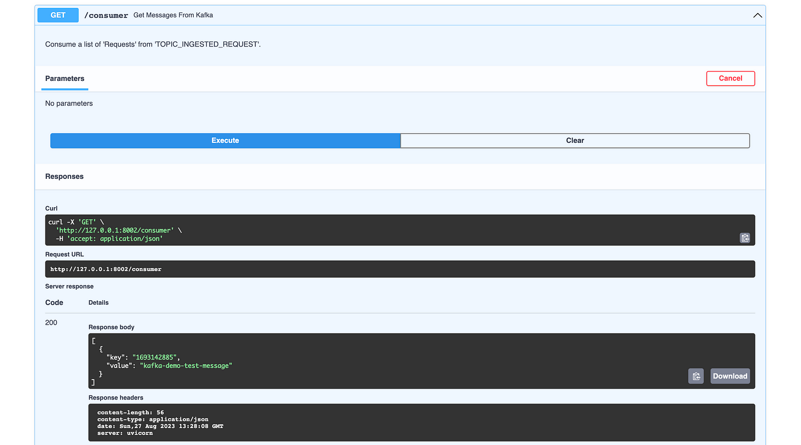

# kafka-fast-api-demo

This is a starter project for you to get hands on FAST-API integrated with Apahce KAFKA.

As part of this project we will be launching all the resources as docker containers.

| Service         | Details       |
| -------------        | ------------- |
| broker|Kafka Broker|
|zookeeper||
|kafka-ui| For viewing the data and topic details|
|api-demo|An Application which will help us to produce and consume Kafka Records using Fast API|

`docker compose up --build`

startup:

| API Methods          | Commands       | Details       |
| -------------        | ------------- | ------------- |
| GET /                | http://127.0.0.1:8002/  | Sample test which prints Hello World  |
| POST /producer/{msg} | curl -X POST -H "Content-Type: application/json"  http://localhost:8002/producer/test_message  |Produce the "test_message" with timestamp as the key|
| GET /consumer        | http://127.0.0.1:8002/consumer  |Prints the messages|

Hit the URL http://127.0.0.1:8002/docs

Run producer function with sample message.

Run Consumer function

Kafka UI is accessible at: http://localhost:18080/

